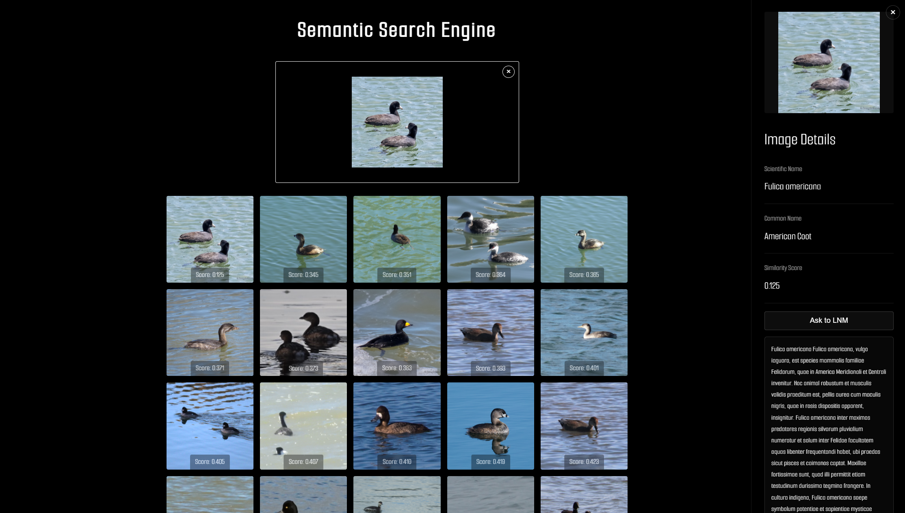

# Image Search Engine 🔍

A powerful and efficient image search engine that uses deep learning to find similar images based on their visual content. This project combines state-of-the-art neural networks with vector database technology to enable fast and accurate image similarity search.



## Features

- **Multiple Model Support**: Compatible with various deep learning architectures:
  - ResNet50
  - EfficientNet
  - MobileNetV3
- **Vector Database Integration**: Uses LanceDB for efficient similarity search
- **Batch Processing**: Optimized for processing large image datasets
- **Web Interface**: User-friendly FastAPI-based web application
- **Configurable**: Easy-to-modify YAML configuration files
- **Multi-format Support**: Handles various image formats (JPEG, PNG, WebP)

## Installation

1. Clone the repository:

```bash
git clone https://github.com/yourusername/image-search-engine.git
cd image-search-engine
```

2. Create a virtual environment (recommended):

```bash
python -m venv venv
source venv/bin/activate  # On Windows: venv\Scripts\activate
```

3. Install dependencies:

```bash
pip install -r requirements.txt
```

4. Create a `.env` file in the root directory with your configuration:

```env
DATASET_PATH=./dataset
LANCEDB_PATH=./vectordb
MODEL_NAME=resnet50
```

## Usage

### 1. Image Ingestion

To index your image dataset:

```bash
python ingest.py
```

This will:

- Scan your dataset directory for images
- Extract features using the specified model
- Store embeddings in the vector database

### 2. Query Images

To search for similar images:

```bash
python query_db.py --image_path path/to/your/query/image.jpg
```

### 3. Web Interface

Start the web application:

```bash
python -m uvicorn app.app:app --reload
```

Access the web interface at `http://localhost:8000`

## 🔧 Configuration

Configuration files are stored in the `configs/` directory. Available configurations:

- `animals_efficientnet.yml`
- `animals_mobilenetv3.yml`
- `animals_resnet50.yml`
- `ocean_resnet50.yml`
- `ocean_resnet50_v2.yml`

Example configuration:

```yaml
MODEL_NAME: resnet50
MODEL_DIM: 2048
COLLECTION_NAME: images
DATASET_PATH: ./dataset
LANCEDB: ./vectordb
```

## Project Structure

```
image-search-engine/
├── app/                    # Web application
├── configs/                # Model configurations
├── dataset/               # Image dataset directory
├── engine/                # Core search engine components
├── vectordb/              # Vector database storage
├── ingest.py              # Dataset ingestion script
├── query_db.py            # Image query script
└── requirements.txt       # Project dependencies
```

## How It Works

1. **Feature Extraction**: Deep learning models convert images into high-dimensional feature vectors
2. **Vector Storage**: Features are normalized and stored in LanceDB
3. **Similarity Search**: Query images are processed the same way and compared using cosine similarity
4. **Result Ranking**: Most similar images are returned based on vector similarity

## Contributing

Contributions are welcome! Please feel free to submit a Pull Request.

## License

This project is licensed under the MIT License - see the [LICENSE](LICENSE) file for details.

